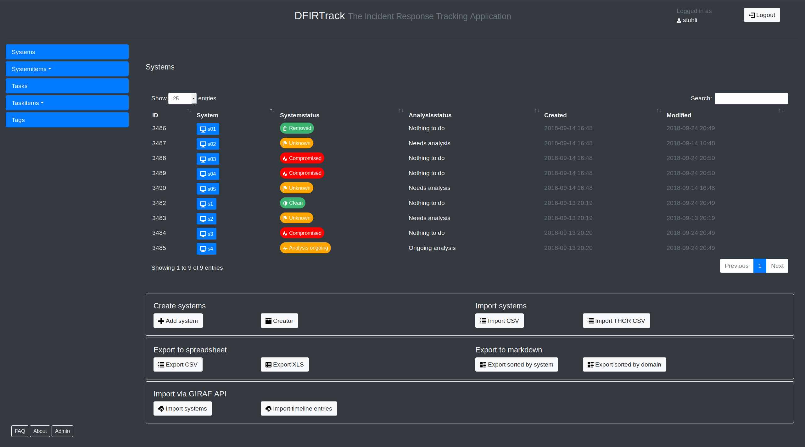

# DFIRTrack

DFIRTrack (Digital Forensics and Incident Response Tracking application) is an open source web application mainly based on [Django](https://www.djangoproject.com/) using a [PostgreSQL](https://www.postgresql.org/) database backend.

In contrast to other great incident response tools, which are mainly case-based and support the work of CERTs, SOCs etc. in their daily business, DFIRTrack is focused on handling one major incident with a lot of affected systems as it is often observed in APT cases. It is meant to be used as a tool for dedicated incident response teams in large cases. So, of course, CERTs and SOCs may use DFIRTrack as well, but they may feel it will be more appropriate in special cases instead of every day work.

In contrast to case-based applications, DFIRTrack works in a system-based fashion. It keeps track of the status of various systems and the tasks associated with them, keeping the analyst well-informed about the status and number of affected systems at any time during the investigation phase up to the remediation phase of the incident response process.



## Features

One focus is the fast and reliable import and export of systems and associated information. The goal for importing systems is to provide a fast and error-free procedure. Moreover, the goal for exporting systems and their status is to have multiple instances of documentation: for instance, detailed Markdown reports for technical staff vs. spreadsheets for non-technical audiences without redundancies and deviations in the data sets. A manager whose numbers match is a happy manager! ;-)

The following functions are implemented for now:

* Importer
    * Creator (fast creation of multiple related instances via web interface) for systems and tasks,
    * CSV (simple and generic CSV based import (either hostname and IP or hostname and tags combined with a web form), should fit for the export capabilities of many tools),
    * Markdown for entries (one entry per system(report)).
* Exporter
    * Markdown for so-called system reports (for use in a [MkDocs](https://www.mkdocs.org/) structure),
    * Spreadsheet (CSV and XLS),
    * LaTeX (planned).

## Installation and dependencies

DFIRTrack is developed for deploying on **Debian Stretch** or **Ubuntu 16.04**. Other *Debian* based distributions or versions may work but were not tested yet. At the moment the project will be focused on Ubuntu LTS and Debian releases.

For fast and uncomplicated installation on a dedicated server including all dependencies an [Ansible](https://docs.ansible.com/ansible/latest/) playbook and role was written (available [here](https://github.com/stuhli/dfirtrack_ansible)).

For a minimal setup the following dependencies are needed:

* `django` (2.0),
* `django_q` (0.9.1),
* `djangorestframework`,
* `gunicorn`,
* `postgresql`,
* `psycopg2-binary`,
* `python3-pip`,
* `PyYAML`,
* `requests`,
* `virtualenv`,
* `xlwt`.

**Note that there is no `settings.py` in this repository.** [This file](https://github.com/stuhli/dfirtrack_ansible/blob/master/roles/dfirtrack/templates/settings.py.j2) is submitted via Ansible or has to be copied and configured by hand. That will be changed in the future (see issues for more information).

## Docker Environment

An experimental Docker Compose environment for local-only usage is provided in this project. Run the following command
in the project root directory to start the environment:

```
docker-compose up
```

A user *admin* is already created. A password can be set with:

```
docker/setup_admin.sh
```

The application is located at [localhost:8000](http://localhost:8000).

## Built-in software

The application was created by implementing the following libraries and code:

* [Bootstrap](https://github.com/twbs/bootstrap)
* [clipboard.js](https://github.com/zenorocha/clipboard.js)
* [DataTables](https://github.com/DataTables/DataTables)
* [jQuery](https://github.com/jquery/jquery)
* [Open Iconic](https://github.com/iconic/open-iconic)
* [Popper.js](https://github.com/FezVrasta/popper.js)

## License

See `LICENSE` file in the root directory.

## Disclaimer

This software is in an early alpha phase so a lot of work has to be done. Even if some basic error checking is implemented, as of now the usage of DFIRTrack mainly depends on proper handling.

*DFIRTrack was not and most likely will never be intended for usage on publicly available servers. Nevertheless some basic security features were implemented (in particular in connection with the corresponding ansible role) always install DFIRTrack in a secured environment (e. g. a dedicated virtual machine or in a separated network)!*
